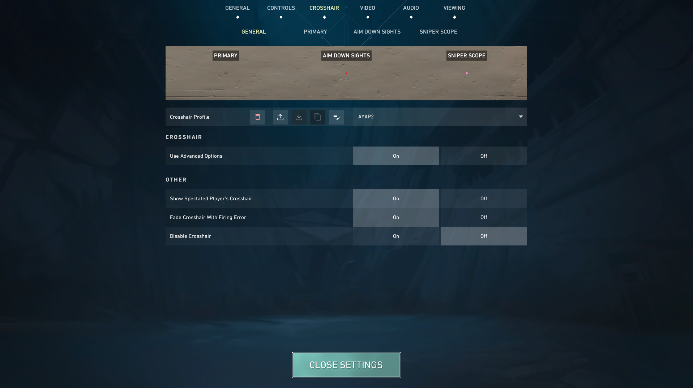
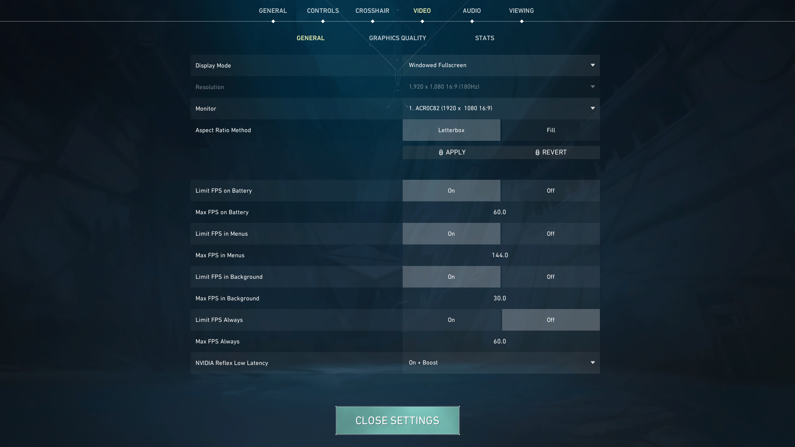
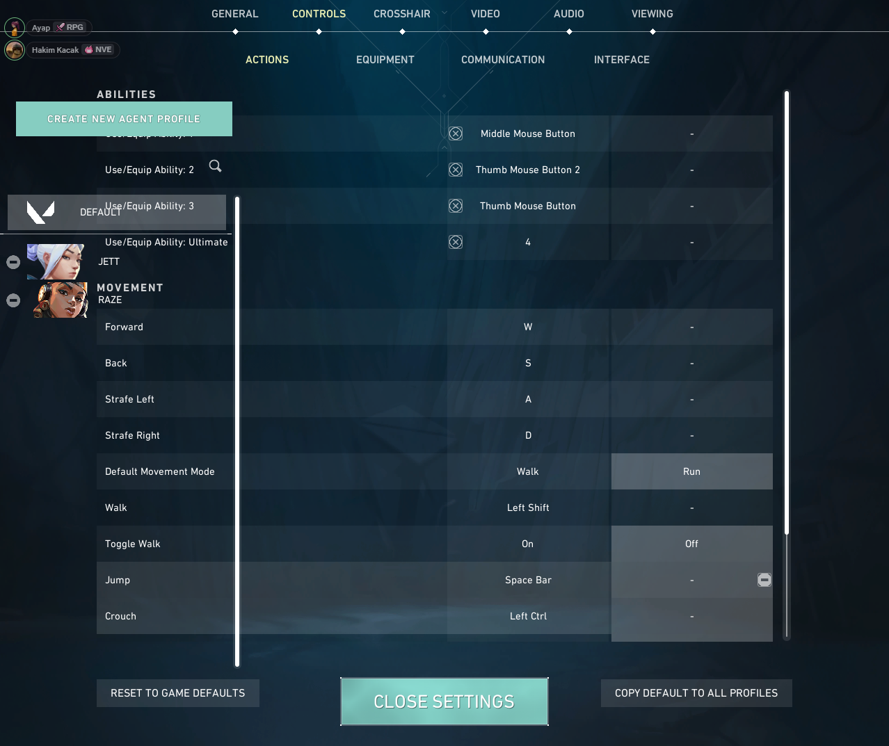
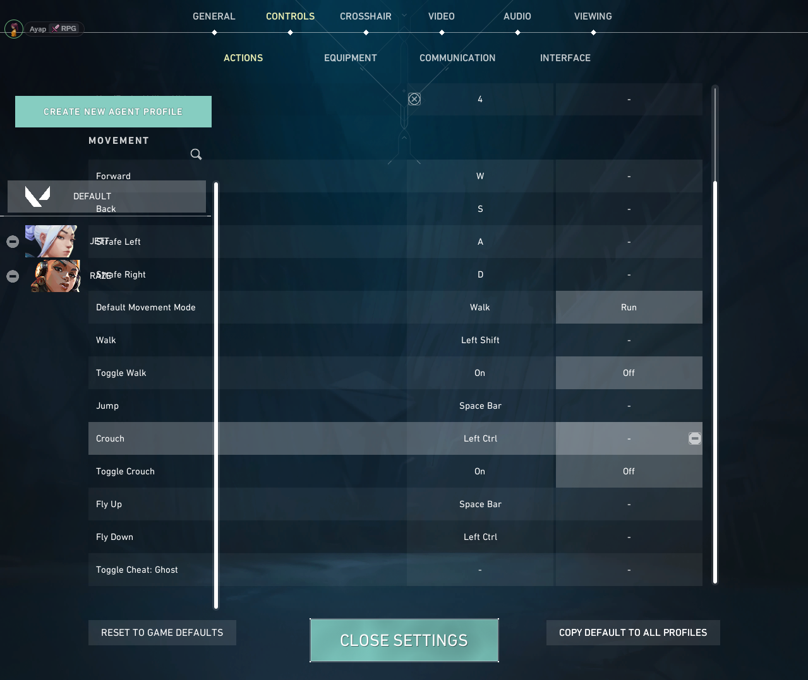
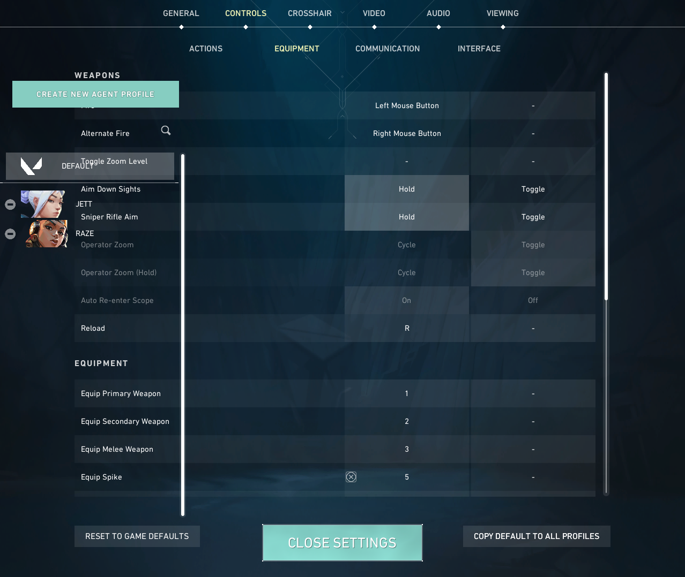
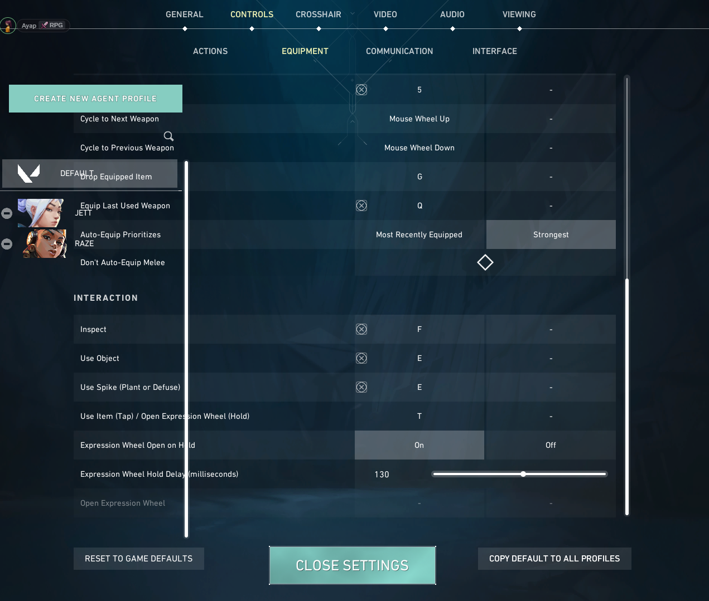
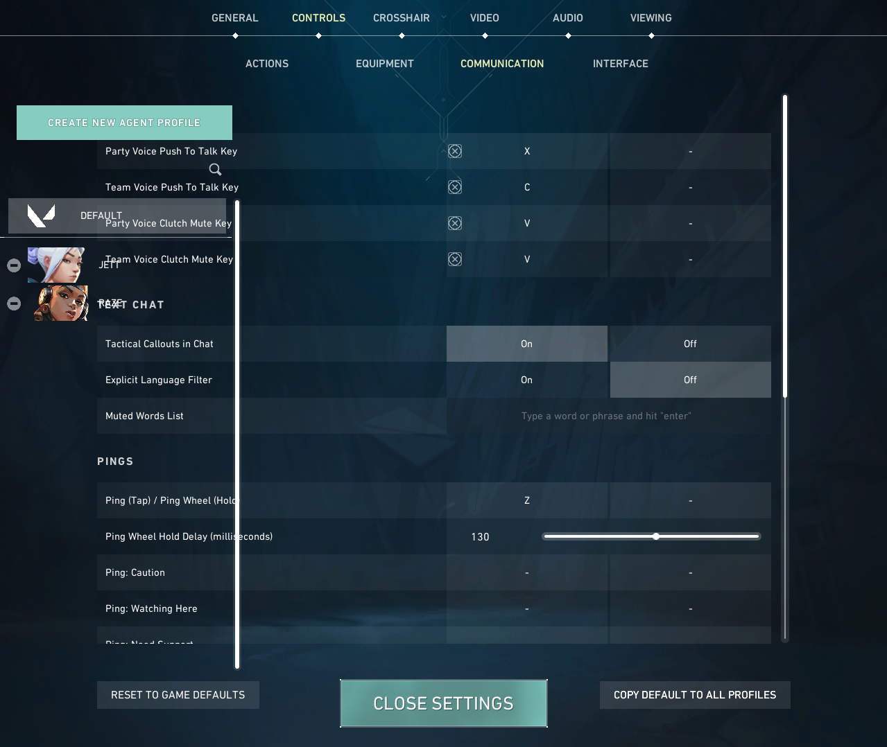
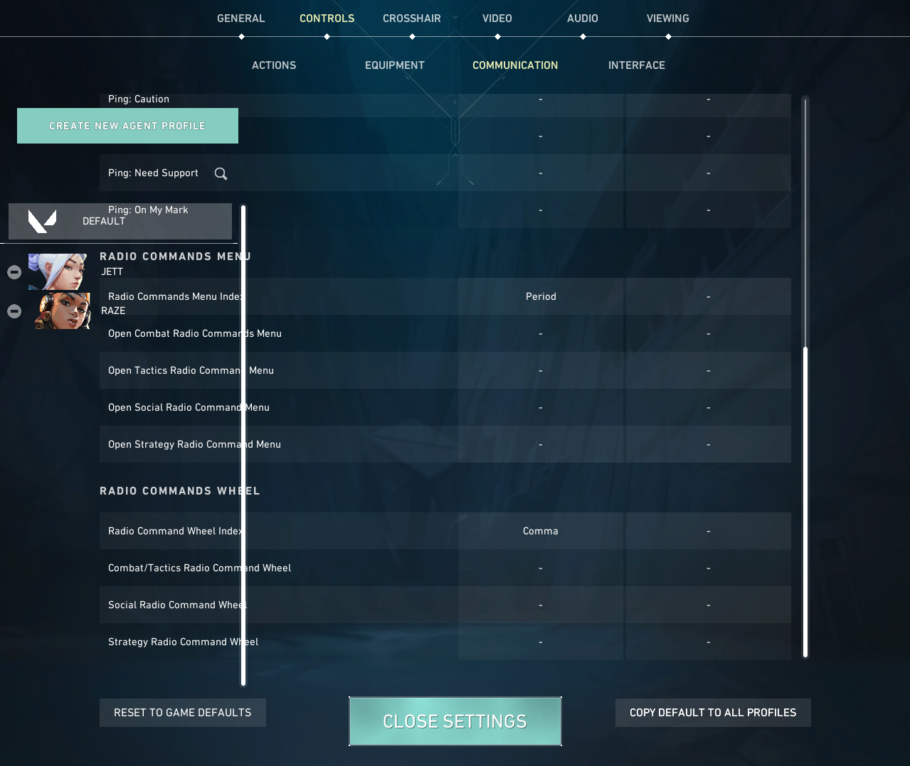
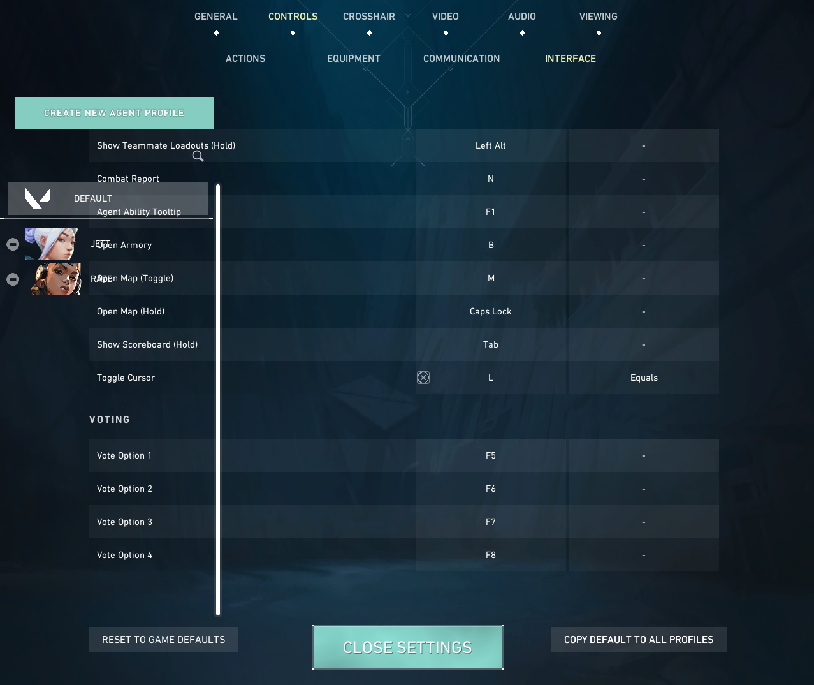

# 🎮 Valorant Settings

This repo stores my personal Valorant settings so I can easily refer back to them.

## Mouse Settings
- DPI: 1600
- Sensitivity: 0.17
- Scoped Sensitivity: 1.1
- ADS Sensitity Multiplier: 1.0
- Polling Rate: 1000 Hz
- Angle Snap: ON

## Crosshair

Here’s my Valorant crosshair setup:

### Crosshair Code
0;p;0;c;1;s;1;P;c;1;u;F88CCCFF;o;0.22;m;1;0t;1;0l;3;0v;3;0o;1;0a;1;0f;0;1b;0;A;c;7;u;F88CCCFF;h;0;d;1;0b;0;1o;0;1a;1;1m;0;1f;0;S;b;1;c;8;t;F88CCCFF;o;1

## Video Settings

## Video Settings
- Resolution: 1440x1080
- Display Mode: Fullscreen
- Graphics Quality: Low (for max FPS)

## Keybinds

Here are my Valorant keybind screenshots:

### Keybind 1

### Keybind 2

### Keybind 3

### Keybind 4

### Keybind 5

### Keybind 6

### Keybind 7

