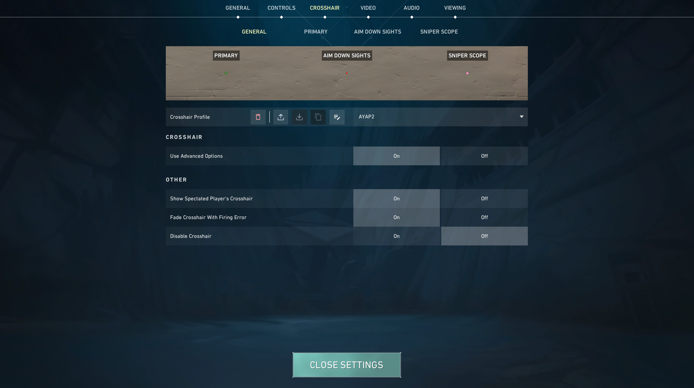
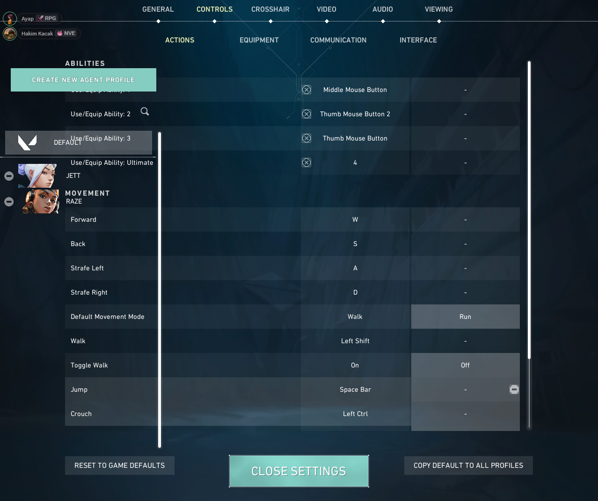
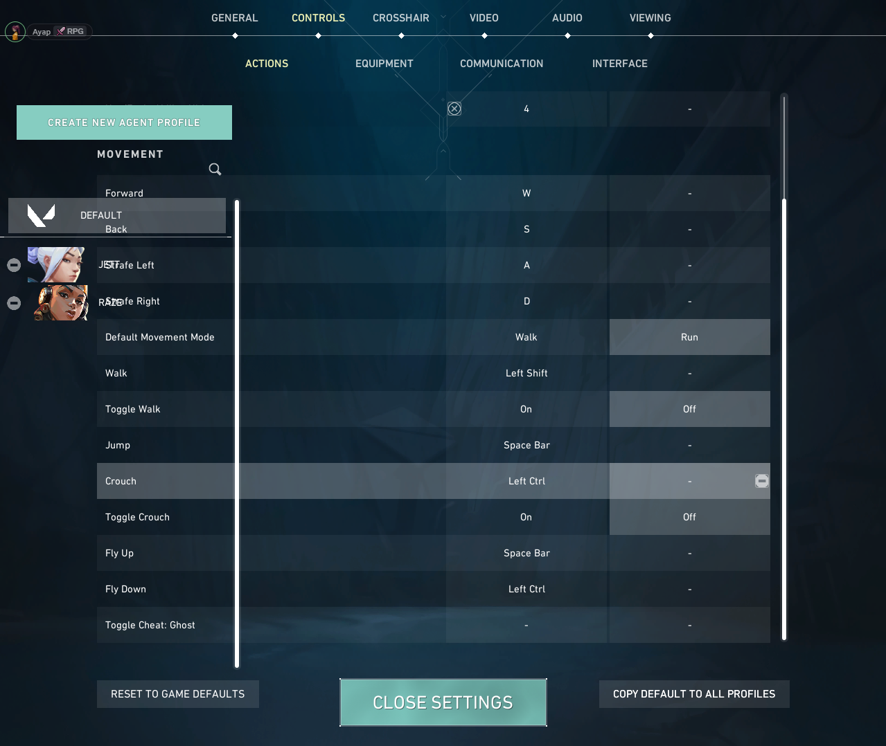
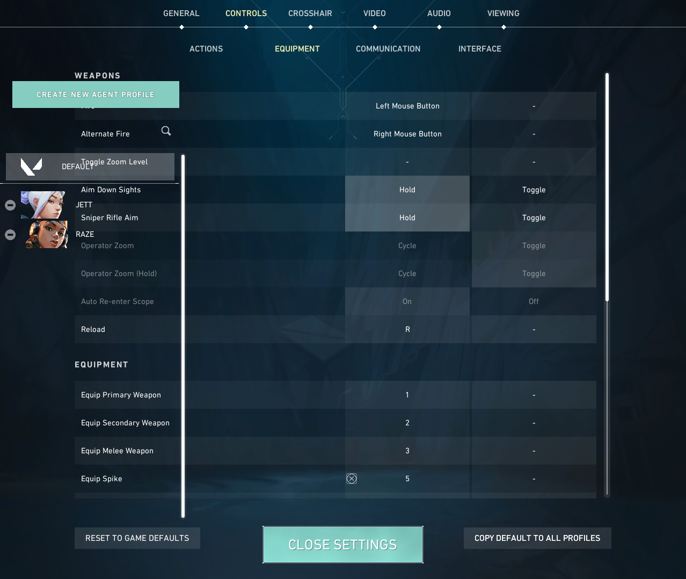
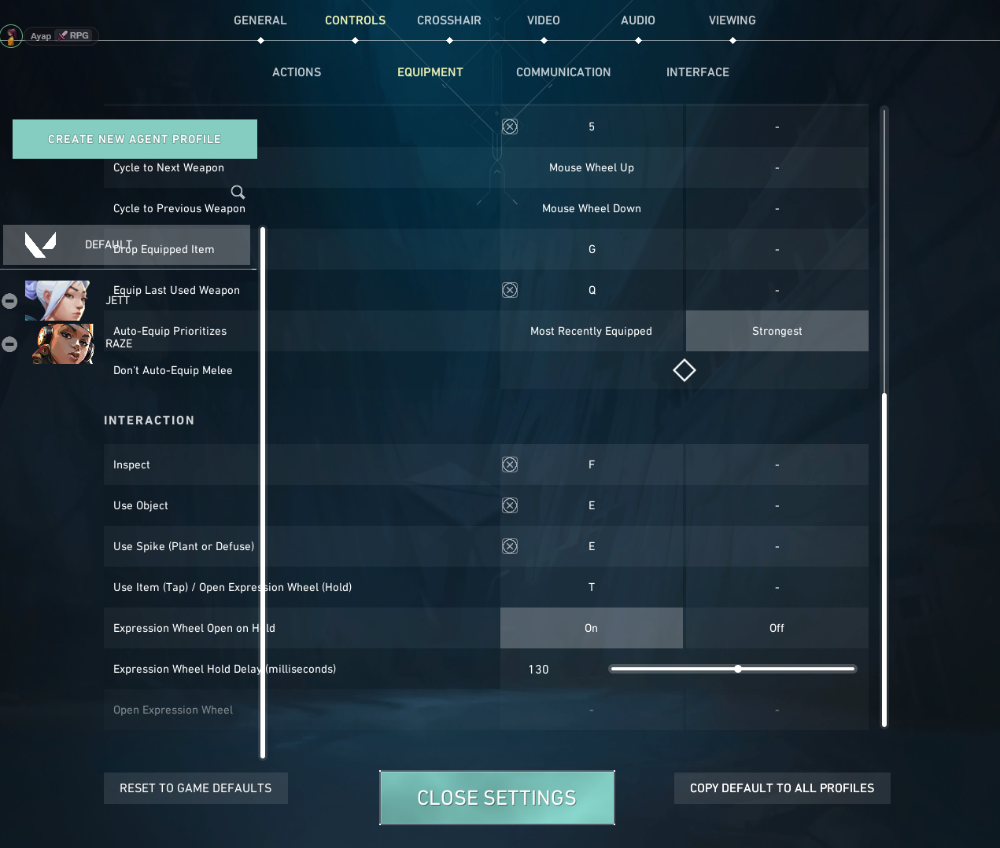
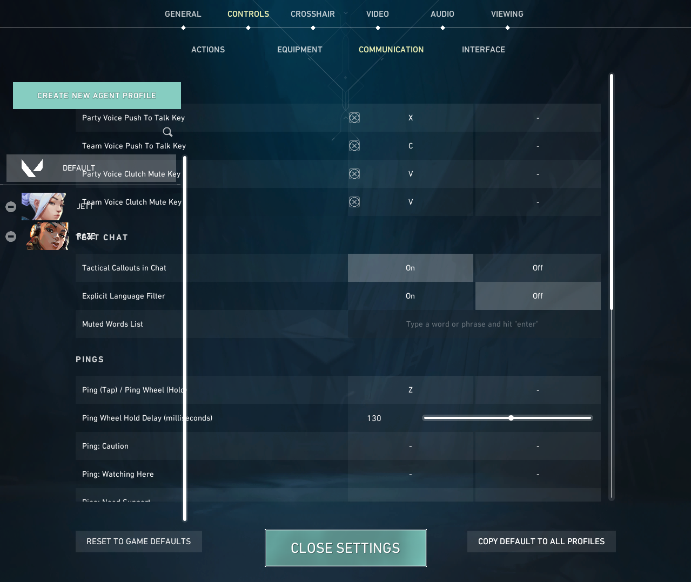
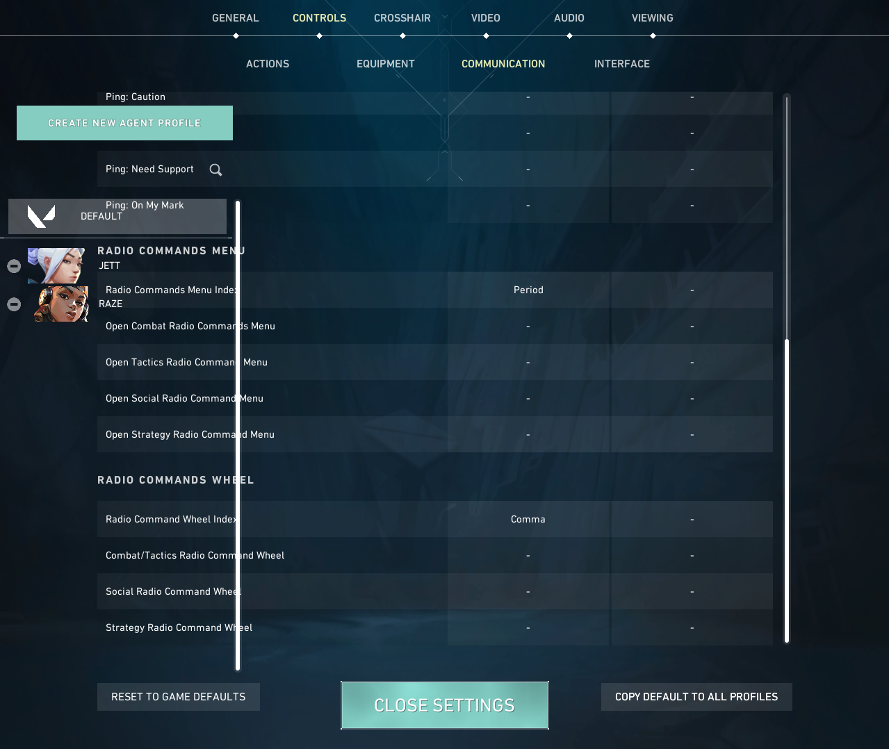
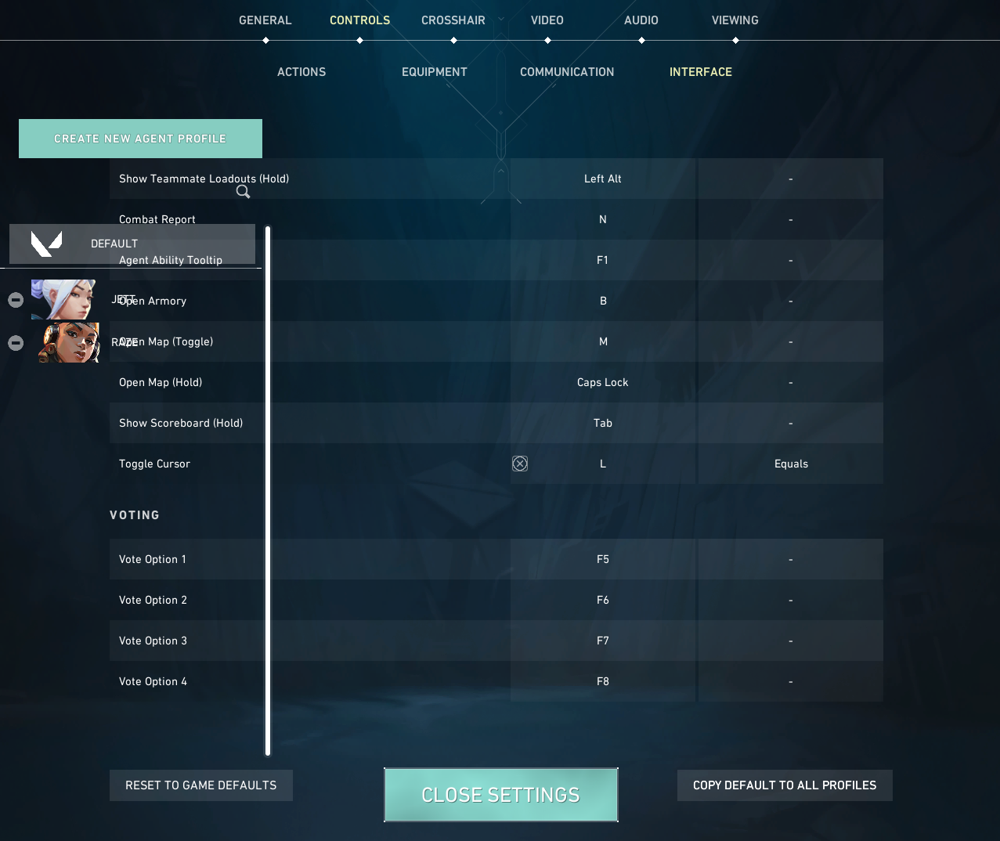

# 🎮 Valorant Settings

This repo stores my personal Valorant settings so I can easily refer back to them.

## Mouse Settings
- DPI: 1600
- Sensitivity: 0.17
- Scoped Sensitivity: 1.1
- ADS Sensitity Multiplier: 1.0
- Polling Rate: 1000 Hz
- Angle Snap: ON

## Crosshair

Here’s my Valorant crosshair setup:

### Crosshair Code
0;c;1;s;1;P;c;8;u;000000FF;o;1;b;1;f;0;m;1;0t;1;0l;1;0v;1;0o;2;0a;0;0f;0;1b;0;S;c;0;s;1.0;o;1

---

## Video Settings
- Resolution: 1440x1080
- Display Mode: Fullscreen
- Graphics Quality: Low (for max FPS)

## Keybinds

Here are my Valorant keybind screenshots:

### Keybind 1

### Keybind 2

### Keybind 3

### Keybind 4

### Keybind 5

### Keybind 6

### Keybind 7

---

## Copyright

© 2026 Iman. All rights reserved.  
This repository is for personal reference only. Screenshots and settings are my own gameplay configuration.
